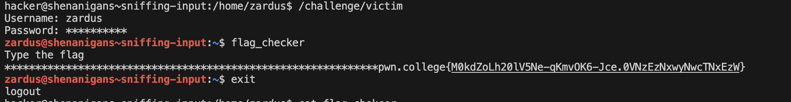
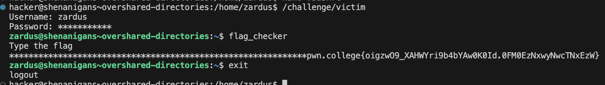
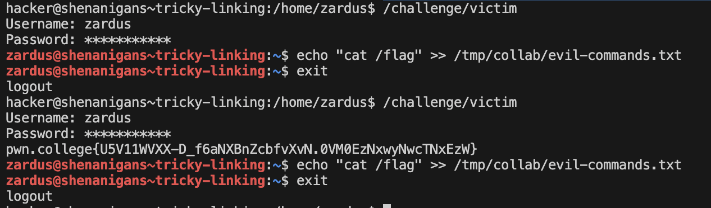
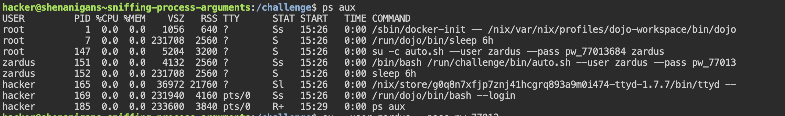
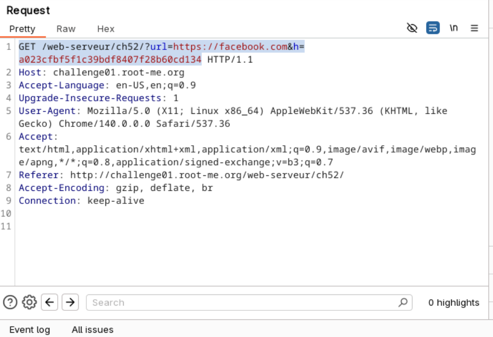

# MIST TASKPHASE-1
# 1 Linux Questions
Linux Luminarium Module at pwn.college.
## 1.1File Globbing
### 1.1.1. Matching with *
Starting from your home directory, change your directory to /challenge, but use globbing to keep the argument you pass to cd to at most four characters! Once you're there, run /challenge/run for the flag!
#### Solving :
```
cd /ch*
/challenge/run
```
>Flag : pwn.college{Yb-cAG6PnBkvEN-7wVEvK_OYXx_.QXxIDO0wyNwcTNxEzW}
### 1.1.2. Matching with ?
Starting from your home directory, change your directory to /challenge, but use the ? character instead of c and l in the argument to cd! Once you're there, run /challenge/run for the flag!
#### Solving :

```
cd /?ha??enge
./run
```
>Flag : pwn.college{IheDAG4mjuMwGym-tiRF0X3PVkK.QXyIDO0wyNwcTNxEzW}
### 1.1.3. Matching with []
We've placed a bunch of files in /challenge/files. Change your working directory to /challenge/files and run /challenge/run with a single argument that bracket-globs into file_b, file_a, file_s, and file_h!
#### Solving :
```
cd /challenge/files
/challenge/run file_[bash]
```
>Flag : pwn.college{YmOsRKdAacG4mxPbyNTAzx0U7uC.QXzIDO0wyNwcTNxEzW}
### 1.1.4. Matching paths with [] 
Once more, we've placed a bunch of files in /challenge/files. Starting from your home directory, run /challenge/run with a single argument that bracket-globs into the absolute paths to the file_b, file_a, file_s, and file_h files!
#### Solving :

```
/challenge/run /challenge/files/file_[bash]
```
>Flag : pwn.college{sqiW_ciyg8iF-uAId4aCsAIZwd3.QX0IDO0wyNwcTNxEzW}
### 1.1.5. Mixing globs
 We put a few happy, but diversely-named files in /challenge/files. Go cd there and run /challenge/run, providing a single argument: a short (3 characters or less) globbed word with two * globs in it that covers every word that contains the letter p.
#### Solving :

```
cd /challenge/files
/challenge/run *p*
```
>Flag : pwn.college{E0FjeXbDP9zqe88P4tq2b43c4wO.0lM3kjNxwyNwcTNxEzW}
### 1.1.6. Mixing globs
#### Solving :
We put a few happy, but diversely-named files in /challenge/files. Go cd there and, using the globbing you've learned, write a single, short (6 characters or less) glob that (when passed as an argument to /challenge/run) will match the files "challenging", "educational", and "pwning"!
```
cd /challenge/files
 /challenge/run [cep]*
```
>Flag : pwn.college{4-qxcgBve1k3Qy39wZ20Xf4aEkc.QX1IDO0wyNwcTNxEzW}

### 1.1.7. Exclusionary Globbing
Armed with this knowledge, go forth to /challenge/files and run /challenge/run with all files that don't start with p, w, or n!
#### Solving :
```
cd /challenge/files
/challenge/run [^pwn]*
```
>Flag : pwn.college{gm6OniuhIeosnx2i1z7JU4qf7hf.QX2IDO0wyNwcTNxEzW}
### 1.1.8. Tab Completion
This challenge has copied the flag into /challenge/pwncollege, and you can freely cat that file. But you can't type the filename: we used some serious trickery to make sure that you must tab-complete it. Try it out!
#### Solving :
```
cat /challenge/pwn<tab> 
```
>Flag :pwn.college{AkcrujzLWqQLAPB-OVPsJRLtIwt.0FN0EzNxwyNwcTNxEzW}
### 1.1.9. Multiple tab
This challenge has a /challenge/files directory with a bunch of files starting with pwncollege. Tab-complete from /challenge/files/p or so, and make your way to the flag!


#### Solving :
```
After some brute force i could thde flag using
cat /challenge/files/pwncollege-flag
```
>Flag :pwn.college{AtSbCN-g94Dg5q6rBi7Kz5lOhff.0lN0EzNxwyNwcTNxEzW}
### 1.1.10.Tab Completion on Command
Tab completion is for more than files! You can also tab-complete commands. This level has a command that starts with pwncollege, and it'll give you the flag. Type pwncollege and hit the tab key to auto-complete it!
#### Solving :
```
pwncollege<tab>-->pwncollege-5301
```
>Flag :pwn.college{cOsnZLaOFdOPPkIV6ts7rFj6Stb.0VN0EzNxwyNwcTNxEzW}


## 1.2 Split-piping stderr and stdout
### 1.2.1 : Redirecting Output
In this challenge, you must use this output redirection to write the word PWN (all uppercase) to the filename COLLEGE (all uppercase).
#### Solving :
```
echo PWN>COLLEGE
```
>Flag :pwn.college{EzN0zdusShlVhiH29CpGJrWde5D.QX0YTN0wyNwcTNxEzW}

### 1.2.2 : Redirecting more output
You'll notice that /challenge/run will still happily print to your terminal, despite you redirecting stdout. That's because it communicates its instructions and feedback over standard error, and only prints the flag over standard out!
#### Solving :
/challenge/run > myflag
cat myflag
>Flag :pwn.college{kVsMGViQuU4DCVRkeY8m9atGwRO.QX1YTN0wyNwcTNxEzW}
### 1.2.3 : Appending Output
To practice, run /challenge/run with an append-mode redirect of the output to the file /home/hacker/the-flag. The practice will write the first half of the flag to the file, and the second half to stdout
#### Solving :
```
/challenge/run >>/home/hacker/the-flag
```
>Flag :pwn.college{EgKIDx8W4DQXDDhbLABkpTErC0k.QX3ATO0wyNwcTNxEzW}
### 1.2.4 : Redirecting Erros
In this challenge, you will need to redirect the output of /challenge/run, like before, to myflag, and the "errors" (in our case, the instructions) to instructions. You'll notice that nothing will be printed to the terminal, because you have redirected everything! You can find the instructions/feedback in instructions and the flag in myflag when you successfully pull this off!
#### Solving :
```
 /challenge/run 1>myflag 2>instructions
 cat myflag
```
>Flag :pwn.college{U1wYsE903oNmjLoNzLyhTSM0gNq.QX3YTN0wyNwcTNxEzW}
### 1.2.5 : Redirecting Input
You can do interesting things with a lot of different programs using input redirection! In this level, we will practice using /challenge/run, which will require you to redirect the PWN file to it and have the PWN file contain the value COLLEGE! To write that value to the PWN file, recall the prior challenge on output redirection from echo!
#### Solving :
```
echo COLLEGE >PWN
/challenge/run < PWN

```
>Flag :pwn.college{c9mfsQt6d14VUHC4CArP7LtbJGu.QXwcTN0wyNwcTNxEzW}
### 1.2.6 : Grepping Stored Result 
In preparation for more complex levels, we want you to:

Redirect the output of /challenge/run to /tmp/data.txt.
This will result in a hundred thousand lines of text, with one of them being the flag, in /tmp/data.txt.
grep that for the flag!
#### Solving :
```
/challenge/run > /tmp/data.txt
 grep "pwn" /tmp/data.txt
```
>Flag :pwn.college{0D9HDGWP50s29F2o4HfJE7GVRXK.QX4EDO0wyNwcTNxEzW}
### 1.2.7 : Grepping live output 
Now try it for yourself! /challenge/run will output a hundred thousand lines of text, including the flag. grep for the flag!
#### Solving :
```
/challenge/run | grep pwn
```
>Flag :pwn.college{ozvh8nzbCARICy5_dhvUCEMoUFI.QX5EDO0wyNwcTNxEzW}
### 1.2.8 : grepping Erros
 Like the last level, this level will overwhelm you with output, but this time on standard error. grep through it to find the flag!
#### NOTE : | just pipes standard output so we have to convert errors into stdout then we can use grep 
#### Solving :
```
/challenge/run 2>&1 | grep pwn
```
>Flag :pwn.college{QX30wUeF9lX49Ij5Z6Oze6q3xK0.QX1ATO0wyNwcTNxEzW}
### 1.2.9 : Flitering with grep -v
Use grep -v to filter out all the lines containing "DECOY" and reveal the real flag!
#### Solving :
```
/challenge/run | grep -v DECOY
```
>Flag :pwn.college{QMclrg-wRg9oXv2LQ_q_zQIfseB.0FOxEzNxwyNwcTNxEzW}
### 1.2.10 : Duplicating piped data with tee
Now, you try it! This process' /challenge/pwn must be piped into /challenge/college, but you'll need to intercept the data to see what pwn needs from you!
#### Solving :
```
/challenge/run | tee ok||/challenge/college
cat ok
/challenge/pwn --secret MzoukRLQ | /challenge/college

```
>Flag :pwn.college{MzoukRLQADsdhi4vWPGZ-PoHgZj.QXxITO0wyNwcTNxEzW}
### 1.2.11 : Process Substitution for input
Now, you'll diff two sets of command outputs: /challenge/print_decoys, which will print a bunch of decoy flags, and /challenge/print_decoys_and_flag which will print those same decoys plus the real flag.
#### Solving :
```
diff <(/challenge/print_decoys_and_flag ) <(/challenge/print_decoys)
```
>Flag : pwn.college{Qdisgytp_OMRk6H1P8xWqYlPo92.0lNwMDOxwyNwcTNxEzW}


### 1.2.12 : Writing to mulitple programs
In this challenge, we have /challenge/hack, /challenge/the, and /challenge/planet. Run the /challenge/hack command, and duplicate its output as input to both the /challenge/the and the /challenge/planet commands! Scroll back through the previous challenges "Duplicating piped data with tee" and "Process substitution for input" if you need a refresher on this method.
#### Solving :
```
 /challenge/hack | tee >( /challenge/the)| tee >(/challenge/planet)
```
>Flag :pwn.college{oWzastuJWJrbRi56yR1afz5s-be.QXwgDN1wyNwcTNxEzW}

### 1.2.13 : Split pipping stderr and stdout

In this challenge, you have:

/challenge/hack: this produces data on stdout and stderr
/challenge/the: you must redirect hack's stderr to this program
/challenge/planet: you must redirect hack's stdout to this program
#### Solving :
```
/challenge/hack 2> >( /challenge/the ) | /challenge/planet
```
>Flag :pwn.college{EHUbyxuE9Ztjn7pzjWkjZfL7f9K.QXxQDM2wyNwcTNxEzW}

### 1.2.14 : Named Pipe
You'll need to create a /tmp/flag_fifo file and redirect the stdout of /challenge/run to it. If you're successful, /challenge/run will write the flag into the FIFO! Go do it!
#### Solving :
```
cd /tmp
mkfifo flag_fifo
/challenge/run >/tmp/flag_fifo

In a different window 
cat /tmp/flag_fifo
```
>Flag :pwn.college{s4qCojEoa1Z2sECcECfh7WBi_QF.01MzMDOxwyNwcTNxEzW}

## 1.3 Silly Shenanigans

### 1.3.1 : Bashrc Backdoor
In this challenge, we'll pretend that you've broken into a victim user's machine! That user is named zardus, with a home directory of /home/zardus. You, as the hacker user, have write access to his .bashrc, and zardus has read-access to /flag. The victim is simulated by the script /challenge/victim, and you can launch this script at any time to observe the victim logging into the computer. Can you get the flag?
#### Solving :
```
cd /home/zaradus
nano .bashrc
#In the file add cat /flag
/challenge/victim
```
>Flag :pwn.college{U2dTSoOw-_qNs-ivnnsmcxe2WPt.0VMzEzNxwyNwcTNxEzW}
### 1.3.2 : Sniffing Input
This time, Zardus doesn't keep the flag lying around in a readable file after he logs in. Instead he'll run a command named flag_checker, manually typing the flag into it for verification.

Your mission is to use your continued write access to Zardus's .bashrc to intercept this flag. Remember how you hijacked commands in the Pondering PATH module? Can you use that capability to hijack the flag_checker?
#### Solving :
Since it was mentioned similar to pondering paths ,i created a flag_checker command in my home directory and changed the  PATH env to ~ in .bashrc of zardus .The following is the flag_checker command
```
echo "Type the flag"
read flagg
echo "$flagg"
```
The .bashrc in /home/zardus
```
# this sets up a scary red shell prompt!
PS1='\[\033[01;31m\]\u@\h\[\033[00m\]:\[\033[01;34m\]\w\[\033[00m\]$ '

# add your attack below this line!
export PATH="/home/hacker"
```

>Flag :pwn.college{M0kdZoLh20lV5Ne-qKmvOK6-Jce.0VNzEzNxwyNwcTNxEzW}

### 1.3.3 : Overshared Directories
In this challenge, for convenience, Zardus opened up his home directory:

zardus@dojo:~$ chmod a+w /home/zardus
As you know, there are lots of sensitive files in that directory such as .bashrc! Can you replicate the previous attack with write access to /home/zardus instead of /home/zardus/.bashrc?
#### Solving :
chmod a+w /home/zardus gives write permission for all users.So i just deleted the existing .bashrc since the original .bashrc had write only permissions and copy pasted the .bashrc from previous question 

>Flag :pwn.college{oigzwO9_XAHWYri9b4bYAw0K0Id.0FM0EzNxwyNwcTNxEzW}
### 1.3.4 : 
Recall from the previous level that, having write access to /tmp/collab, the hacker user can replace that evil-commands.txt file. Also remember from Comprehending Commands that files can link to other files. What happens if hacker replaces evil-commands.txt with a symbolic link to some sensitive file that zardus can write to? Chaos and shenanigans!

You know the file to link to. Pull off the attack, and get /flag (which, for this level, Zardus can read again!).
#### Solving :
It was mentioned we have to run /challenge/victim twice so i figured we have to write cat /flag in .bashrc and then on running it the second time we get the flag .So i created a symbolic link from .txt file which has write access to .bashrc 
```
rm /tmp/collab/evil-commands.txt
ln -s /home/zardus/.bashrc /tmp/collab/evil-commands.txt
```

>Flag :pwn.college{U5V11WVXX-D_f6aNXBnZcbfvXvN.0VM0EzNxwyNwcTNxEzW}
### 1.3.5 : Sniffing process arguments

#### Solving :

```
cd /challenge
su zardus
pw_77013684
sudo cat /flag
```
>Flag :pwn.college{YAuF9tfSxg-PvaE5WxjL5KaaV-v.0FOzEzNxwyNwcTNxEzW}
### 1.3.6 : Snooping on configuration
Naturally, Zardus stores his key in .bashrc. Can you steal the key and get the flag?
#### Solving :
```
cd /home/zardus
cat .bashrc
flag_getter --key sk-1420626432
```
>Flag :pwn.college{QStfOH926zSDHknzTwgRqJfJmTz.0lM0EzNxwyNwcTNxEzW}


# 2.Webex
## 2.1 HTML SourceCode
### Solving :
The source code of the webpage gives the password which is also the flag
>Flag : nZ^&@q5&sjJHev0
## 2.2 
### Solving 
I solved this question again cause i forgot to store the flag the first time .
We have to add X-Forwarded-For: 10.0.0.0 header and only 10.0.0.0 to 10.255.255.255 works not other IP Address since 
### The entire range of 10.0.0.0 to 10.255.255.255 (known in networking as the 10.0.0.0/8 prefix) is completely reserved for private networks (LANs)

### Doubt : I have doubts in how subnetting and private ip and public ip work 
>Flag :Ip_$po0Fing
## 2.3 HTTP Oenredirect
Find a way to make a redirection to a domain other than those showed on the web page.
### Solving :


When we view the request on clicking a link through burpsuite ,we see two fields website link and hash (in this case md5) .So we have to change botht the url and hash inorder to get the flag
```
url=https://reddit.com
h=a95df25a09475babd575fc50f0b0eca1
```
>Flag : e6f8a530811d5a479812d7b82fc1a5c5

## 2.4User agent
Admin is really dumb...
### Solving :
The website had the text you are not in the "admin" browser so i just changed the 'user agent' part which holds browser info into admin and got the flag 
>Flag : rr$Li9%L34qd1AAe27
## 2.5 weak password
My first instinct was to try admin admin but it didnt work for some reason ,so i checked the source code when we type something in and the request was as follows
```
GET /web-serveur/ch3/ HTTP/1.1
Host: challenge01.root-me.org
Cache-Control: max-age=0
Authorization: Basic YWRtaW46 <<<<<<-- I noticed this and it was admin in base 64
Accept-Language: en-US,en;q=0.9
Upgrade-Insecure-Requests: 1
User-Agent: Mozilla/5.0 (X11; Linux x86_64) AppleWebKit/537.36 (KHTML, like Gecko) Chrome/140.0.0.0 Safari/537.36
Accept: text/html,application/xhtml+xml,application/xml;q=0.9,image/avif,image/webp,image/apng,*/*;q=0.8,application/signed-exchange;v=b3;q=0.7
Accept-Encoding: gzip, deflate, br
Connection: keep-alive
```
Tried admin and empty string didnt work ,at the end when i typed admin admin it worked :|
>admin
# Cryptography
## 3.2 
Easy Frequency Analysis question where each letter is
replaced by an emoji:
The most common letters in the English language are E, T, A, O, I, N, S, H, R on mapping it with the emojis we get  Ulysses by James Joyce.

## 3.3 Spiral Cipher
cipher:taskphaWL_PL4sOingpYefdngaP{_diddL40ap}y5rn_s1m37
## Solving : Just used dcode to the solve the cipher not sure if the flag i got is right though
>Flag : 	taskphase{4r73m1s_n0_fOWL_PL4YPL5y}paddingpadding


